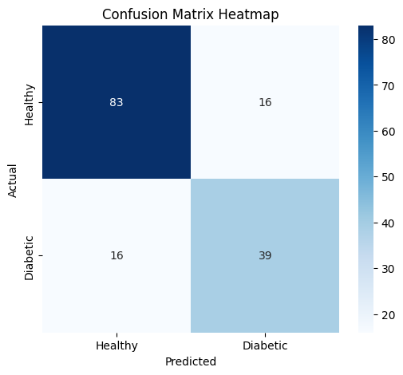

# Diabetes Prediction System

An end to end Machine Learning project using a Deep Neural Network to predict the onset of diabetes based on diagnostic measures. This project demonstrates data preprocessing, model architecture design, early stopping to prevent overfitting, and professional model deployment strategies.

## 🚀 Project Overview
This project uses the **Pima Indians Diabetes Dataset** to classify whether a patient has diabetes. It implements a Sequential Neural Network built with Keras/TensorFlow. To ensure the model is "real-world ready," I implemented standard scaling for feature normalization and used a Train/Test split for honest evaluation.

## 🛠️ Technical Stack
* **Language:** Python
* **Environment Management:** `uv`
* **Deep Learning:** TensorFlow / Keras
* **Data Science:** Pandas, NumPy, Scikit-Learn
* **Deployment Tools:** Joblib (for scaler persistence)
* **Visualization:** Seaborn, Matplotlib

## 📊 Model Architecture
The model is a Sequential Deep Neural Network consisting of:
1. **Input Layer:** 8 features (Pregnancies, Glucose, Blood Pressure, Skin Thickness, Insulin, BMI, Pedigree, Age).
2. **Hidden Layer 1:** 12 neurons, ReLU activation.
3. **Hidden Layer 2:** 8 neurons, ReLU activation.
4. **Output Layer:** 1 neuron, Sigmoid activation for binary classification.

## 📉 Key Features Implemented
* **Standard Scaling:** Features are normalized using `StandardScaler`. To prevent data leakage, the scaler is fitted **only** on the training set and then applied to the test set.
* **Early Stopping:** Monitored `val_loss` with a patience of 10 epochs. This automatically stops training when the model stops generalizing to new data, preventing overfitting.
* **Model Persistence:** The architecture is saved as `model.json` and weights as `model.weights.h5`, allowing the model to be loaded into a production environment without retraining.

## 📈 Performance Results
* **Accuracy:** ~75-77% on unseen test data.
* **Early Stopping Point:** Model typically reaches peak performance between Epoch 15 and 25.

### Confusion Matrix Insights
The model shows strong performance in identifying healthy patients (True Negatives) while effectively flagging diabetic cases.

